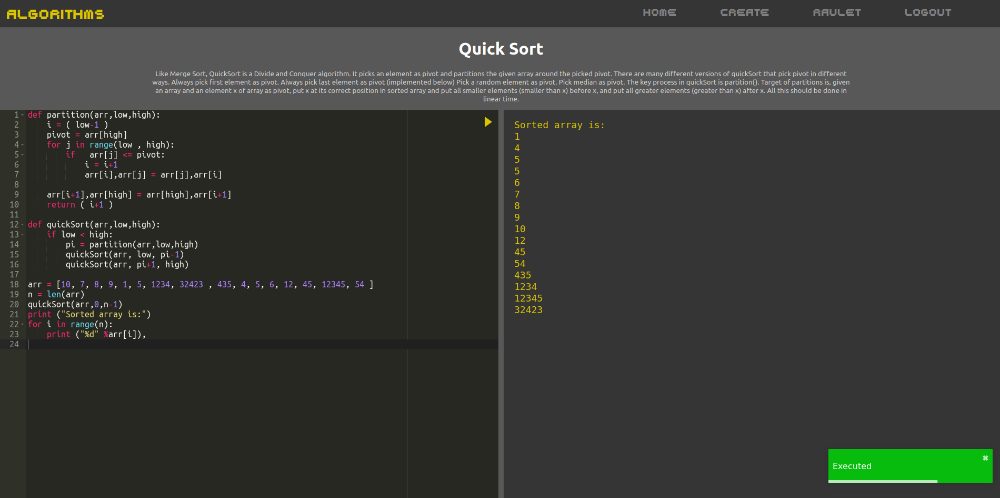

# Codealgos
Codealgos is a web application for displaying, editing and executing code in Pyhton, it is focused on algorithms and data structures that can be useful on coding interviews or challenges. The web has plenty of coding examples and you can code them and execute them on the same page. You can save and modify your own code and see code of other programmers. The execution of Python is done on a docker sandbox. The code editor is the Ace Editor.



## Getting Started

These instructions will get you a copy of the project up and running on your local machine for development and testing purposes. See deployment for notes on how to deploy the project on a live system.

### Prerequisites
- Docker
- Docker-compose
- Npm
- Node

### Installing

#### Frontend

Go to the frontend and install de dependencies.

```
~/frontend$ npm install
```
#### Backend

Go to the backend and build the containers

```
~/backend$ sudo docker-compose up --build
```

End with an example of getting some data out of the system or using it for a little demo

## Running

### Frontend

Start the application on port 3000

```
~/frontend$ npm start
```

### Backend
Start the backend on port 8000

```
~/backend$ sudo docker-compose up
```

## Deployment

## Built With

* [React](https://reactjs.org/) - The web framework used
* [Redux](https://redux.js.org/) - State container
* [Django](https://www.djangoproject.com/) - Backend
* [Django Rest Framework](https://www.django-rest-framework.org/) - API Rest
* [Docker](https://www.docker.com/) - Containerized
* [Posgresql](https://www.postgresql.org/) - Database
* [AceEditor](https://ace.c9.io/) - Web code editor

## Authors

* **Iván Pérez Fita** - [Zar21](https://github.com/Zar21)
* **Raül Ojeda Gandia** - [raulojeda22](https://github.com/raulojeda22)

## License

This project is licensed under the GNU License - see the [LICENSE.md](LICENSE.md) file for details